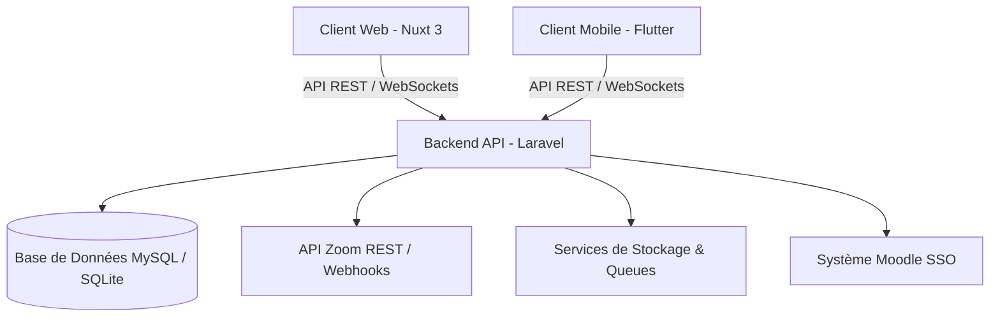

# 🎓 ALREI (Learnup) - Plateforme de Formation en Ligne (LMS)

> **Présentation globale du projet, Architecture technique et Guide de déploiement**

---

## 📋 Table des Matières
1. [Analyse & Vision du Projet](#1-analyse--vision-du-projet)
2. [Architecture Système & Stack Technique](#2-architecture-système--stack-technique)
3. [Architecture Backend (Laravel API)](#3-architecture-backend-laravel-api)
4. [Architecture Mobile (Flutter)](#4-architecture-mobile-flutter)
5. [Architecture Frontend (Nuxt 3 / Vue 3)](#5-architecture-frontend-nuxt-3--vue-3)
6. [Fonctionnalités Principales](#6-fonctionnalités-principales)
7. [Stratégie d'Automatisation & Workflow](#7-stratégie-dautomatisation--workflow)
8. [Sécurité & Protection des Données](#8-sécurité--protection-des-données)
9. [Impact Business & Modèle Economique](#9-impact-business--modèle-economique)
10. [Guide de Démarrage Rapide](#10-guide-de-démarrage-rapide)

---

## 1. Analyse & Vision du Projet

**ALREI (Learnup)** est une solution globale de **Système de Gestion de l'Apprentissage (LMS - Learning Management System)** conçue pour répondre aux exigences modernes de la formation professionnelle continue et de l'enseignement en ligne.

### Problématiques résolues :
- **Digitalisation de la formation** : Offrir un accès 24/7 aux ressources pédagogiques (vidéos, PDF, quizz, devoirs).
- **Apprentissage hybride (Blended Learning)** : Combiner les cours asynchrones avec des sessions synchrone en direct via **Zoom**, **Google Meet** ou **Microsoft Teams**.
- **Engagement et suivi** : Rapprocher étudiants et formateurs via une **messagerie instantanée en temps réel**, un suivi statistique de la progression et la génération automatique de certificats de réussite.

---

## 2. Architecture Système & Stack Technique

L'écosystème **ALREI** s'appuie sur une **architecture API-First multi-plateformes** :



### Technologies clés :
- **Frontend Web** : Nuxt 3, Vue 3 (Composition API), TypeScript, Bootstrap 5, `@nuxtjs/i18n` (Français, Anglais, Portugais).
- **Backend API** : Laravel 10+, PHP 8.2+, MySQL, Laravel Sanctum, Redis / Queues.
- **Applications Mobiles** : Flutter (iOS & Android).
- **Intégrations externes** : Zoom REST API v2, Moodle LMS SSO, WebSockets / Pusher.

---

## 3. Architecture Backend (Laravel API)

Le cœur métier est propulsé par une architecture en couches propre (*Clean Architecture*) :

- **Pattern Controllers - Services - Repositories** : Séparation stricte de la logique HTTP, des règles métier et de l'accès aux données.
- **Authentification & Sécurité** : Authentification stateless via **Laravel Sanctum / JWT** avec gestion fine des rôles et permissions (Étudiant, Formateur, Administrateur).
- **API Endpoints principaux** :
  - `/api/v1/auth` : Inscription, connexion, gestion du profil, téléversement d'avatar, modification du mot de passe.
  - `/api/v1/courses` : Catalogues, leçons, modules, progression.
  - `/api/v1/live-sessions` : Intégration et génération automatique de réunions Zoom.
  - `/api/v1/messages` : Messagerie en temps réel inter-utilisateurs.
  - `/api/v1/quizzes` & `/api/v1/assignments` : Évaluations et devoirs.

---

## 4. Architecture Mobile (Flutter)

L'application mobile permet une continuité d'apprentissage sur iOS et Android :

- **Pattern de conception** : MVVM / Bloc / Riverpod pour une gestion d'état réactive.
- **Lancement de visioconférence** : Intégration native des liens Zoom (`join_url`) avec passage automatique vers l'application Zoom installée sur l'appareil.
- **Mode hors-ligne / Cache** : Stockage local des données de cours et des informations de profil.

---

## 5. Architecture Frontend (Nuxt 3 / Vue 3)

Le frontend web est conçu pour la vitesse, le référencement (SEO) et une expérience utilisateur haut de gamme :

- **Modularité des composants** :
  - `student-dashboard.vue` : Tableau de bord dédié aux apprenants.
  - `instructor-dashboard.vue` : Espace de gestion des formateurs.
  - `admin-dashboard.vue` : Espace d'administration globale.
  - `messages.vue` : Interface de messagerie instantanée réactive avec mise à jour optimiste (< 1ms).
- **Gestion des Live Classes** :
  - Composant `LiveClassCard.vue` avec compte à rebours interactif, statut *LIVE NOW* en temps réel et bouton 1-clic pour rejoindre Zoom.
- **Gestion de Profil & Personnalisation** :
  - Modification du mot de passe sécurisée pour tous les rôles.
  - Upload d'avatar personnalisé (suppression de l'image générique par défaut).

---

## 6. Fonctionnalités Principales

| Fonctionnalité | Description |
| :--- | :--- |
| 🎥 **Cours en direct (Zoom)** | Génération de réunions Zoom via l'API, planification et accès direct depuis l'espace étudiant. |
| 💬 **Messagerie instantanée** | Communication en temps réel entre étudiants, enseignants et administrateurs. |
| 🎓 **Certificats automatiques** | Génération de certificats PDF téléchargeables dès la validation d'un cours à 100%. |
| 📝 **Quizz & Devoirs** | Passer des examens en ligne, soumettre des devoirs et consulter les corrections/notes. |
| 🌐 **Multi-langues** | Interface intégralement traduite en Français, Anglais et Portugais. |
| 👤 **Gestion de Profil** | Mise à jour des informations personnelles, mot de passe et photo de profil. |

---

## 7. Stratégie d'Automatisation & Workflow

1. **Rappels automatiques de cours** :
   - Un planificateur (*Cron / Schedulers*) envoie une notification (Mail/Push) 15 minutes avant le début de chaque session Zoom aux étudiants inscrits.
2. **Replays automatiques** :
   - Traitement des Webhooks Zoom (`recording.completed`) pour attacher automatiquement la vidéo enregistrée à la leçon correspondante.
3. **Attribution automatique des certificats** :
   - Déclenchement d'un événement `CourseCompleted` pour générer le certificat dès l'obtention des notes requises aux quizz.

---

## 8. Sécurité & Protection des Données

- **Validation stricte des entrées** : Protection contre XSS, CSRF et Injections SQL sur l'ensemble des requêtes API.
- **Accès restreint aux Live Classes** : Seuls les étudiants inscrits au cours ont accès au lien sécurisé `join_url` de Zoom.
- **Protection du profil** : Exigence de l'ancien mot de passe pour toute modification de mot de passe utilisateur.

---

## 9. Impact Business & Modèle Économique

- **Monétisation flexible** : Vente de cours à l'unité, abonnements mensuels/annuels, et accès aux sessions de coaching live VIP.
- **Gain de temps opérationnel** : Automatisation des inscriptions, des visioconférences Zoom et de la délivrance des certificats.
- **Scalabilité** : Architecture prête à accueillir des dizaines de milliers d'étudiants simultanés grâce à Nuxt 3 (SSR/SSG) et à la séparation des services backend.

---

## 10. Guide de Démarrage Rapide

### Prérequis
- **Node.js** : v18+ ou v20+
- **PHP** : v8.2+
- **Composer** & **NPM / PNPM**

### Lancement du Frontend (Nuxt 3)
```bash
# Installation des dépendances
npm install

# Démarrage du serveur de développement
npm run dev
```
L'application web sera disponible sur `http://localhost:3000`.

### Compilation pour la Production
```bash
npm run build
```

---
*Document généré pour la plateforme ALREI (Learnup).*
